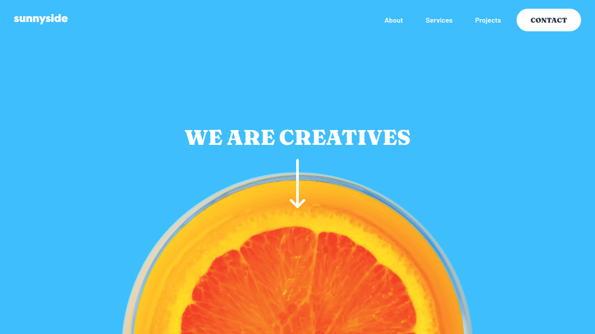

# Frontend Mentor - Sunnyside agency landing page solution

This is a solution to the [Sunnyside agency landing page challenge on Frontend Mentor](https://www.frontendmentor.io/challenges/sunnyside-agency-landing-page-7yVs3B6ef). Frontend Mentor challenges help you improve your coding skills by building realistic projects.

## Table of contents

- [Overview](#overview)
  - [The challenge](#the-challenge)
  - [Screenshot](#screenshot)
  - [Links](#links)
- [My process](#my-process)
  - [Built with](#built-with)
  - [What I learned](#what-i-learned)
- [Author](#author)

## Overview

### The challenge

Users should be able to:

- View the optimal layout for the site depending on their device's screen size
- See hover states for all interactive elements on the page

### Screenshot

### Links

- Live Site URL: [Sunnyside Agency Landing Page](https://matheus-lincon.github.io/sunnyside-landing-page)

## My process

### Built with

- Semantic HTML5 markup
- JavaScript
- CSS
  - Filter
  - Flexbox
  - CSS Grid
  - Position relative and absolute
- Mobile-first workflow

### What I learned

In this challenge I could practice more about responsive layout, some css properties (e.g Filter), pseudo-elements and mobile menu.

## Author

- GitHub - [@matheus-lincon](https://www.github.com/matheus-lincon)
- LinkedIn - [@matheus.lincon.10010](https://www.linkedin.com/in/matheus-lincon-10010)
- Frontend Mentor - [@matheus-lincon](https://www.frontendmentor.io/profile/matheus-lincon)
